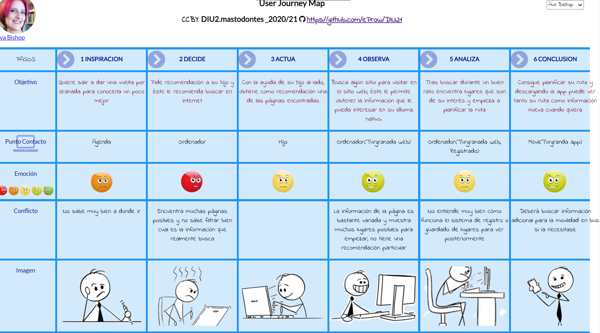

## DIU - Practica1, entregables
- ### Desk research: Análisis Competencia 
>Antes de realizar el análisis, hemos de destacar que un factor muy importante para nuestra decisión es que la página tenga el mayor número de idiomas posible, de modo que sea de mayor accesibilidad y alcance al máximo número de personas de todas las zonas del mundo.  
Procedemos a analizar brevemente las siguientes 3 plataformas de instituciones de información turística que nos han llamado más la atención:

**1.**[**Turgranada**](https://www.turgranada.es/)

Es la página oficial del Patronato de Turismo de Granada con información sobre la oferta turística de Granada y su provincia.  

Presenta un buen diseño para la navegación de la página, además de incluir múltiples idiomas para la lectura de la página desde diversos países (12 en total), a pesar de que, dentro de la variedad de contenidos que pone a disposición, no posee información concreta o exhaustiva sobre los distintos elementos turísticos.  

Permite el registro de los usuarios en la página y el guardado de información propia para la creación y gestión de una guía turística personal.  

Pueden seguirse los eventos propuestos a través de redes sociales como Twitter, Instagram o Facebook y cuenta con su propia app disponible en Google Play y Apple Store.

**2.**[**Moros y Cristianos de Benamaurel**](http://www.morosycristianosbenamaurel.com/)

Página promocional que presenta información turística exclusiva sobre una de las fiestas más importantes de la localidad de Benamaurel, candidata a formar parte del Patrimonio Inmaterial de la Humanidad.

El contenido de la página está bastante enfocado en este evento en particular, por lo que muestra información exhaustiva sobre él, y además presenta un diseño sencillo e intuitivo para la navegación de la página. Sin embargo, no pone a disposición la información sobre los eventos que presenta en otros idiomas.
Pueden seguirse los eventos propuestos a través de Facebook y cuenta con su propia app disponible en Google Play y Apple Store.

**3.**[**Jaén Paraíso Interior**](https://www.jaenparaisointerior.es/)

Página institucional con información turística sobre la provincia de Jaén.

La información se presenta de manera más sobrecargada, cuenta con un diseño menos intuitivo, aunque ofrece la información básica necesaria para su consulta.

Permite la visualización de la página en español o inglés según elección, y muestra información variada a través de redes sociales como Twitter o Facebook, aunque carece de aplicación disponible para dispositivos móviles.

**4.**[**Civitatis Granada**](https://www.granada.info/)

Es una página no institucional de la marca de Civitatis Tours, solo lo destacamos porque puede ser competidor de Turgranada.

Está más orientado a viajes turísticos, tiene como ventaja una mayor facilidad de navegar entre sus menus y en filtrar eventos de distintos tipos, y ofrece reservas de distintos tipos directamente en la página.

Como inconveniente, presenta pocos idiomas en comparación a Turgranada, y se destaca por su apariencia que está más orientado a la parte comercial.

| PLATAFORMAS             | Turgranada | Moros y Cristianos de Benamaurel  | Jaén Paraíso Interior | Civitatis Granada |
|:-----------------------:|:----------:|:-----------:|:-------:|:-------:|
| Idiomas Disponibles     | 12         | 1  | 2  | 3 |
| Web                     | SI         | SI | SI | SI |
| IOS                     | SI         | SI | NO | SI |
| Android                 | SI         | SI | NO | SI |
| Personalización         | SI         | NO | NO | SI |
| Contenido Especializado | NO         | SI | NO | NO |
| Apariencia              | DISEÑADO   | DISEÑADO | NORMAL | DISEÑADO |
| Redes Sociales Oficiales| SI         | SI | SI | SI |
| Realización de reservas | NO         | NO | NO | SI |

>En base a estas comparaciones, hemos decidido escoger [**Turgranada**](https://www.turgranada.es/) por la mayoría de las ventajas que ofrece.

- ##  2 Personas 
### Ava Bishop

### Paul Romero

- ## 2 User Journey Map  (1 por persona)
### Ava Bishop

### Paul Romero

- ## Revisión de Usabilidad 

(Valoración y conclusiones de esta etapa)
