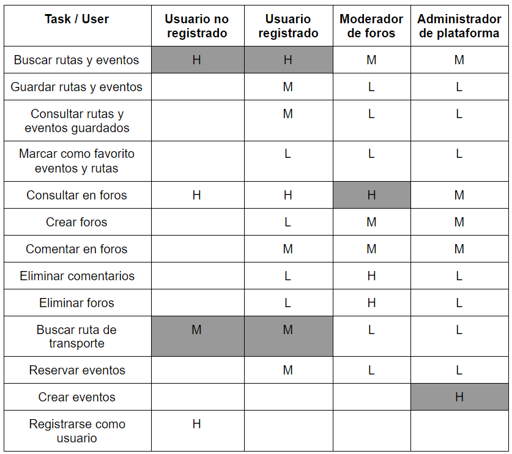
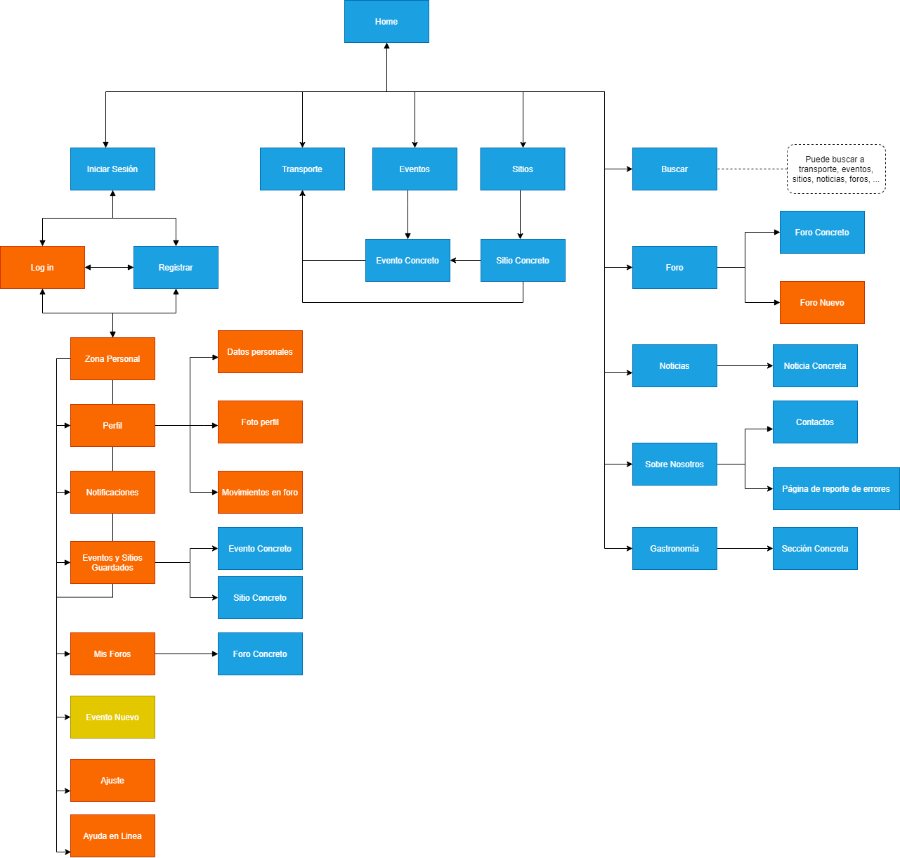

## DIU - Practica2.

### IDEACIÓN 
* Malla receptora de información
  | Interesante | Críticas |
  | :------:   | :------: |
  | Sección de últimas noticias sobre eventos en Granada.    | Funcionamiento incorrecto de la página según el navegador que usa |       
  | Muestra muchos sitios que visitar, catálogo muy amplio sobre cosas para hacer.    | El flujo de navegación es poco intuitivo para las necesidades de cada usuario. |
  | Gran variedad de idiomas    |   Falta de información sobre cada evento, horarios de apertura...   |
  | Aplicación móvil    | La ayuda en línea no se realiza con la eficacia que se espera.  |
  | | No hay una guía para gente que entra en la página por primera vez |
  |  __Preguntas__      |  __Nuevas ideas__    | 
  | ¿Por donde debería empezar a visitar primero? | Ampliar la funcionalidad de la página para usuarios registrados   |
  | ¿Qué ruta me pilla más cerca según mi ubicación? | Reserva de eventos en la misma web  |        
  | ¿Cómo puedo tener una vision global de todos eventos que hay en una zona concreta?  |  Integración con apps de movilidad en transporte como Moovit o Alsa  |
  | ¿Qué horarios de buses debería mirar para llegar a cada sitio si no quiero andar mucho?  | Sección de foros en la página, donde la gente relate sus experiencias haciendo turismo en la provincia y otras personas puedan dar su opinión las entradas, crear hilos de información, valoración de sitios, etc... |
  | ¿Cómo busco eventos según mis gustos actuales? | Uso de tags de preferencia para registrados, que ofrezca distintas recomendaciones orientadas a distintos usuarios  | 
  |  | Interfaz y estilo de página minimalista, amigable y cercana |  

* Mapa de empatía
* Point of View 

* Descripción del proyecto:

Aplicación de turismo para gente no residente en Granada que tiene muy poco conocimiento sobre la zona, centrada principalmente en ofrecer una experiencia fluida y satisfactoria para visitar la provincia 'con todo lujo de detalles'. Traducida a varios idiomas y que permita dar voz a gente que ya la haya visitado a través de la creación de distintos foros en los que otros usuarios podrán comentar, debatir y aconsejar según el tema propuesto. Para habitantes actuales en Granada podrían encontrar fácil y rápido la solución a "dónde ir" ya sea que quieran buscar un sitio cercano o popular.

### PROPUESTA DE VALOR
* ScopeCanvas

### TASK ANALYSIS

* User Task Matrix 

* User/Task flow

Es el diagrama que muestra flujos de acciones que hace el usuario para completar un objetivo/tarea concreta, en nuestro caso, representamos por ejemplo los principales objetivos siguientes:

>> Objetivo1: Consultar y guardar eventos y sitios preferidos (en el diagrama, donde pone eventos/sitios, representa las dos páginas posibilidades seleccionadas según lo que busca).

>> Objetivo2: Buscar buses para un sitio concreto.

>> Objetivo3: Reservar un evento (el cuadrado de consulta es el diagrama de objetivo 1)

### ARQUITECTURA DE INFORMACIÓN

* Sitemap 

>> Leyenda para jerarquía de acceso

>> Mapa de sitio

* Labelling 

### Prototipo Lo-FI Wireframe 

### Conclusiones  
(incluye valoración de esta etapa)
