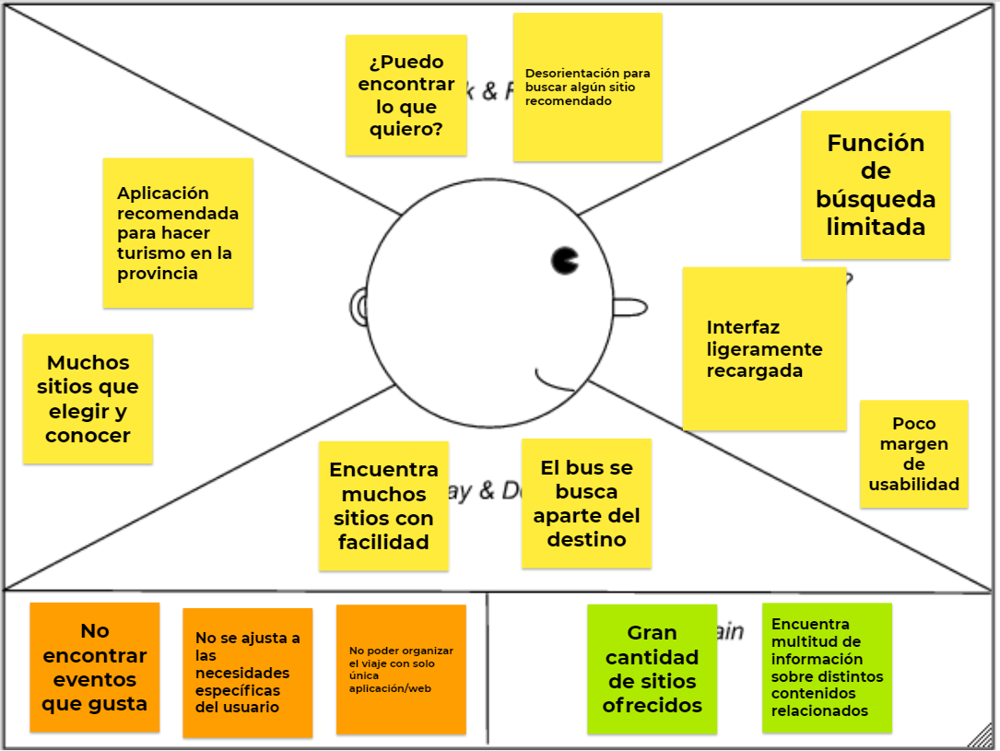
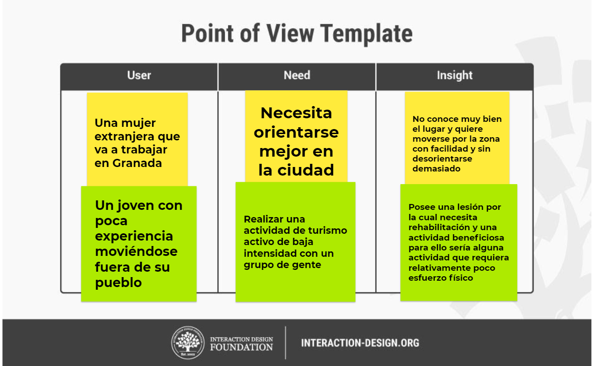
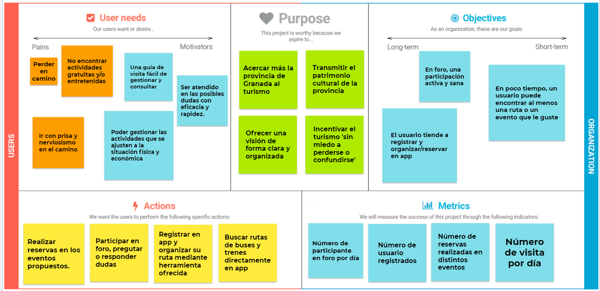
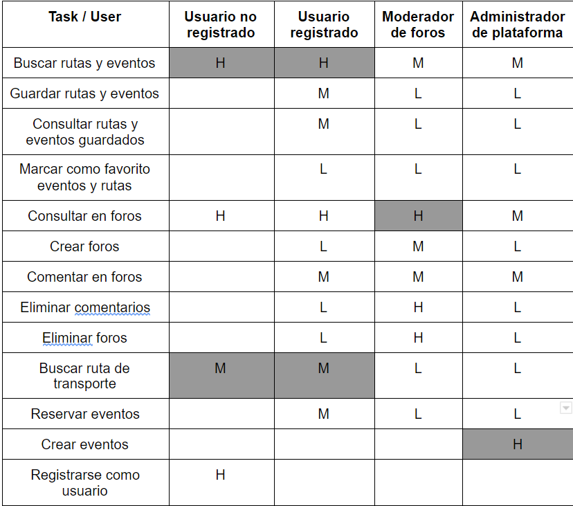
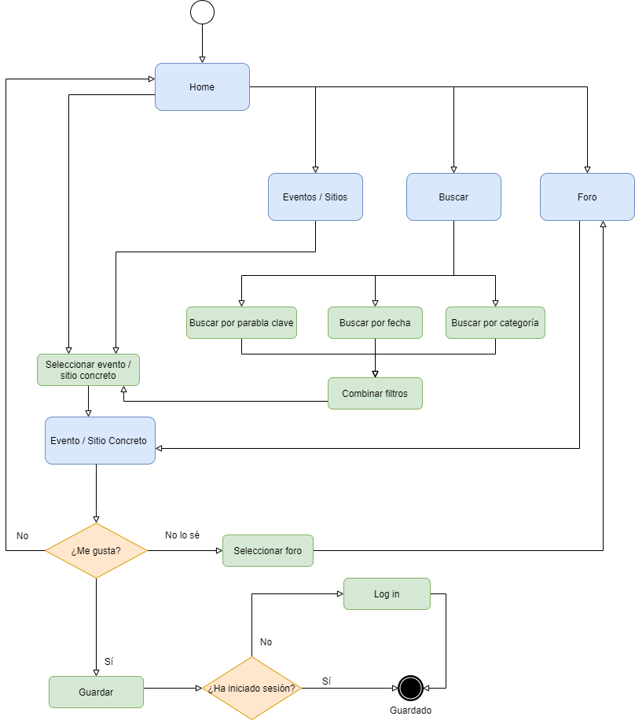
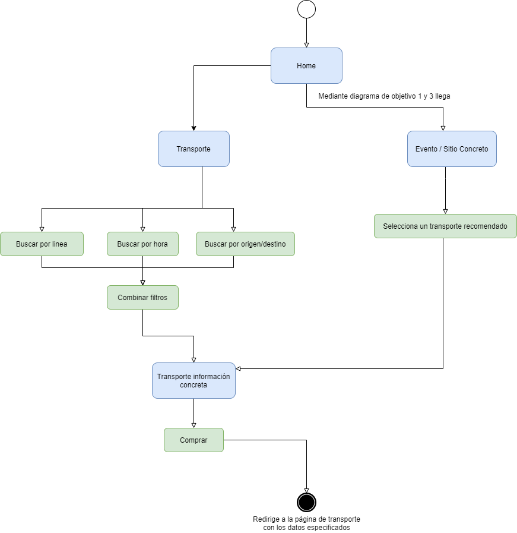
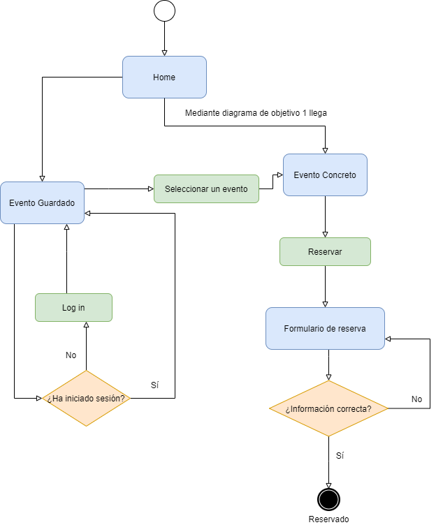
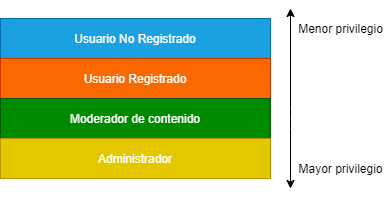
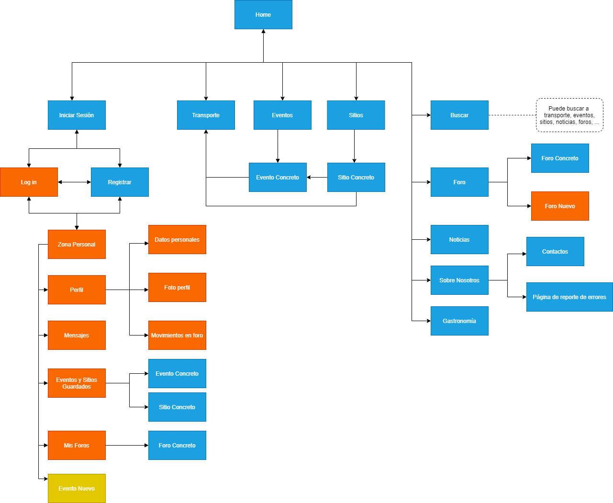

Autores:

Sánchez Suárez, José Antonio   
Wu, Weibin

Github: https://github.com/eProw/DIU21

----
## DIU - Practica2.

### IDEACIÓN 

> En nuestro caso, hemos usado los tres diagramas para análisis de este apartado.

* Malla receptora de información
  | Interesante | Críticas |
  | :------:   | :------: |
  | Sección de últimas noticias sobre eventos en Granada.    | Funcionamiento incorrecto de la página según el navegador que usa |       
  | Muestra muchos sitios que visitar, catálogo muy amplio sobre cosas para hacer.    | El flujo de navegación es poco intuitivo para las necesidades de cada usuario. |
  | Gran variedad de idiomas    |   Falta de información sobre cada evento, horarios de apertura...   |
  | Aplicación móvil    | La ayuda en línea no se realiza con la eficacia que se espera.  |
  | | No hay una guía para gente que entra en la página por primera vez |
  |  __Preguntas__      |  __Nuevas ideas__    | 
  | ¿Por donde debería empezar a visitar primero? | Ampliar la funcionalidad de la página para usuarios registrados   |
  | ¿Qué ruta me pilla más cerca según mi ubicación? | Reserva de eventos en la misma web  |        
  | ¿Cómo puedo tener una vision global de todos eventos que hay en una zona concreta?  |  Integración con apps de movilidad en transporte como Moovit o Alsa  |
  | ¿Qué horarios de buses debería mirar para llegar a cada sitio si no quiero andar mucho?  | Sección de foros en la página, donde la gente relate sus experiencias haciendo turismo en la provincia y otras personas puedan dar su opinión las entradas, crear hilos de información, valoración de sitios, etc... |
  | ¿Cómo busco eventos según mis gustos actuales? | Uso de tags de preferencia para registrados, que ofrezca distintas recomendaciones orientadas a distintos usuarios  | 
  |  | Interfaz y estilo de página minimalista, amigable y cercana |  

* Mapa de empatía

* Point of View 

* Descripción del proyecto:

Aplicación de turismo para gente no residente en Granada que tiene muy poco conocimiento sobre la zona, centrada principalmente en ofrecer una experiencia fluida y satisfactoria para visitar la provincia 'con todo lujo de detalles'. Traducida a varios idiomas y que permita dar voz a gente que ya la haya visitado a través de la creación de distintos foros en los que otros usuarios podrán comentar, debatir y aconsejar según el tema propuesto. Para habitantes actuales en Granada podrían encontrar fácil y rápido la solución a "dónde ir" ya sea que quieran buscar un sitio cercano o popular.

> En base a las tareas realizadas en la práctica anterior, hemos comprobado cuales pueden ser los intereses reales del usuario a partir de la creación de dos personas con gustos e ideales distintos y con sus respectivos journey maps. A raíz de estos, hemos detectado dónde falla la experiencia del usuario en la aplicación que hemos seleccionado para analizar y, fijándonos en los errores que posee a nivel de interacción y navegación, hemos pensado en una nueva aplicación que trate de subsanar dichas imperfecciones para garantizar una experiencia de ususario óptima.

### PROPUESTA DE VALOR
* ScopeCanvas

> Hemos llegado a esta solución del canvas a partir de los intereses y acciones esperadas del usuario en la aplicación (qué es lo que necesita, qué debe de realizar dentro de esta) y los intereses (a corto y largo plazo) y recursos de la organización para medir el éxito de la aplicación. 

### TASK ANALYSIS

> Nos permite saber qué tipos de usuarios utilizan la aplicación, y en base a esto saber qué actividades tienen mayor importancia dentro de esta.

* User Task Matrix 

* User/Task flow

Es el diagrama que muestra flujos de acciones que hace el usuario para completar un objetivo/tarea concreta, en nuestro caso, representamos por ejemplo los principales objetivos siguientes:

>> Objetivo1: Consultar y guardar eventos y sitios preferidos (en el diagrama, donde pone eventos/sitios, representa las dos páginas posibilidades seleccionadas según lo que busca).

>> Objetivo2: Buscar buses para un sitio concreto.

>> Objetivo3: Reservar un evento (el cuadrado de consulta es el diagrama de objetivo 1)

### ARQUITECTURA DE INFORMACIÓN

> Con esto obtenemos una idea más concreta para definir la aplicación, construyendo así de forma simplificada una jerarquía de páginas a partir de las cuales se podrá navegar.

* Sitemap 

>> Leyenda para jerarquía de acceso

>> Mapa de sitio

* Labelling 

> A partir del Sitemap mostrado anteriormente, tendremos la posibilidad de ilustrar con mayor precisión el diseño de nuestra aplicación, ubicando los elementos necesarios en cada página y asignándoles un comportamiento determinado (Wireframe). A los elementos utilizadsos se les asignará un icono que representará su funcionalidad, la cual será descrita en el Labelling.

Término | Icono | Significado
| ------------- | ------- | ------- |
| Ayuda en línea |  | Redirige a la página de ayuda en línea |
| Ajustes |  | Redirige a la página de ajustes |
| Acceder |  | Botón para acceder a area personal de la cuenta o si no está loggeado pues acceder a inicio de sesión |
| Notificaciones |  | Redirige a la página de notificaciones, el circulo rojo se indicaría que haya notificación no leida |
| Buscar |  | Realiza una búsqueda en base a los datos y parámetros establecidos, redirige a la página de busqueda avanzada |
| Cerrar sesión |  | Cierra la sesión actual |
| Favoritos |  | Redirige a la página de favoritos, marca o desmarca como favorito un sitio o evento |
| Foros |  | Redirige a la página de mis foros, obtiene una lista de foros relacionados con el sitio o evento |
| Crear nuevo foro |  | Redirige a la página de crear foro nuevo |
| Enviar |  | Envía una pregunta por la ayuda en línea |
| Subir capturas |  | Enviar capturas desde el dispositivo |
| Activar/Desactivar |  | Marca como activada o desactivada una opción |
| Extensión panel lateral |  | Extensión lateral del menú |
| Idioma |  | Parte para seleccionar idioma |
| Abajo |  | Mover hacia abajo |
| Atras |  | Volver hacia atrás |
| Comentarios |  | Comentarios en foros |
| Derecha |  | Mover hacia derecha |
| Izquierda |  | Mover hacia izquierda |
| Desplegable |   | Un desplegable de contenidos |
| Login With |  | Acceder a la aplicación usando alguna de las tres plataformas |
| Compartir |  | Redirecciona a la plataforma correspondiente para enviar una publicación con el enlace a la noticia ó sección gastronómica |
| Editar |  | Edita un foro creado por el usuario |
| Borrar |  | Borra un foro creado por el usuario |
| Me Gusta |  | Marca como me gusta un comentario del foro, aumentando el número de Me Gusta de dicho comentario|
| Responder |  | Envía una respuesta al un comentario del foro |
| Sitios |  | Muestra los distintos sitios que se pueden visitar en la provincia, realizando una búsqueda o en la sección de sitios recomendados para el usuario |
| Eventos |  | Muestra los distintos eventos a los que se pueden asistir en la provincia, realizando una búsqueda o en la sección de sitios recomendados para el usuario |
| Noticias |  | Muestra las noticias culturales más actuales |
| Gastronomía |  | Muestra distintas secciones con información sobre gastronomía popular, recetas y consejos de elaboración |
| Transporte |  | Muestra las líneas actualmente disponibles de transporte público en la provincia |
| Sobre nosotros |  | Muestra información sobre la organización que da soporte a la página |

### Prototipo Lo-FI Wireframe 

> A partir del Sitemap mostrado anteriormente, tendremos la posibilidad de ilustrar con mayor precisión el diseño de nuestra aplicación, ubicando los elementos necesarios en cada página y asignándoles un comportamiento determinado (Wireframe). A los elementos utilizadsos se les asignará un icono que representará su funcionalidad, la cual será descrita en el Labelling.

### Conclusiones  
En resumen, hemos realizado una vista previa de la aplicación, con las posibles secciones que tendría, además de especificar la funcionalidad general de nuestra propuesta y alizar un bocetado sencillo de las distintas pantallas que mostraría la aplicación, dándole un aspecto más realista.