# DIU - Practica 3

## Moodboard (diseño visual + logotipo)   
> Uso de una tipografía artísticamente distinta, denota cierta artesanía con la que se trata de identificar el origen folclórico de Granada.

> Hemos elegido los colores mostrado en Moodboard porque reflejan una tonalidad tranquila y minimalista que evita una vista recargada de colores distintos, con ciertos colores para indicar elementos destacables en la interfaz de la app, relacionados con la identidad de la ciudad.

> Los iconos son seleccionado por estilo, vamos a usar este estilo, con contorno simple. Su color ya dependerá el color de la página (ej.- Página oculo, icono blanco).

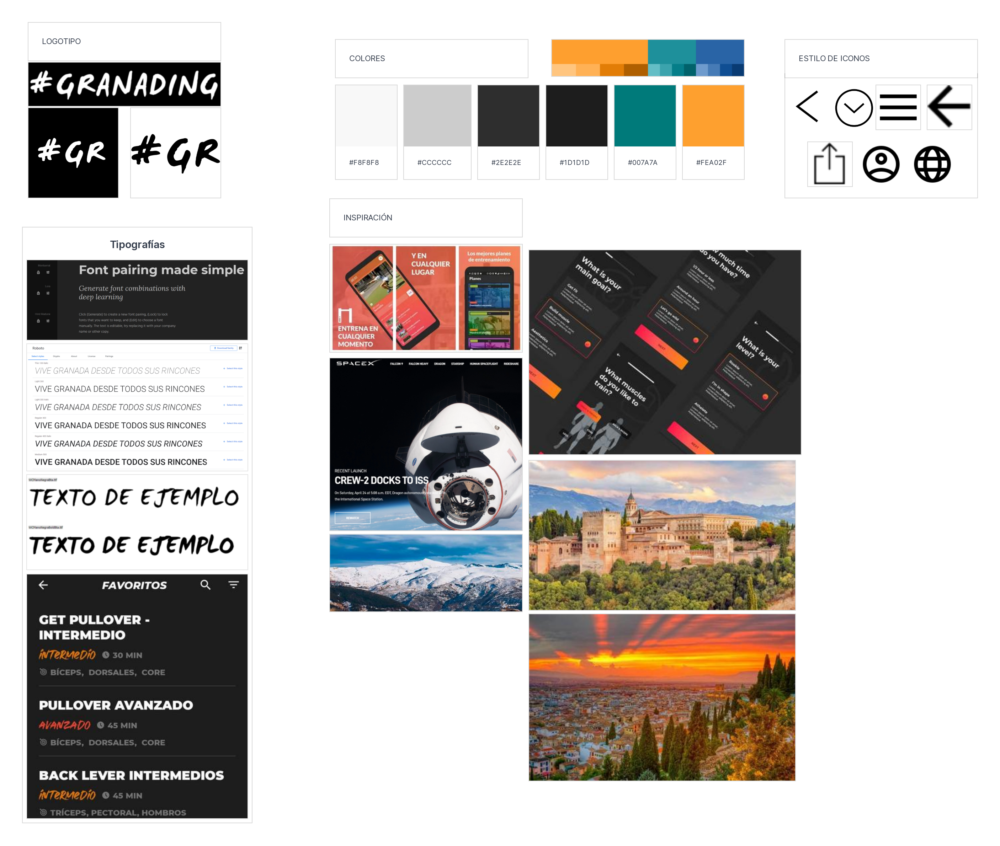

## Landing Page

> Usando editor de imagen + adobe XD hemos creado las imágenes y apariencia de un Landing Page

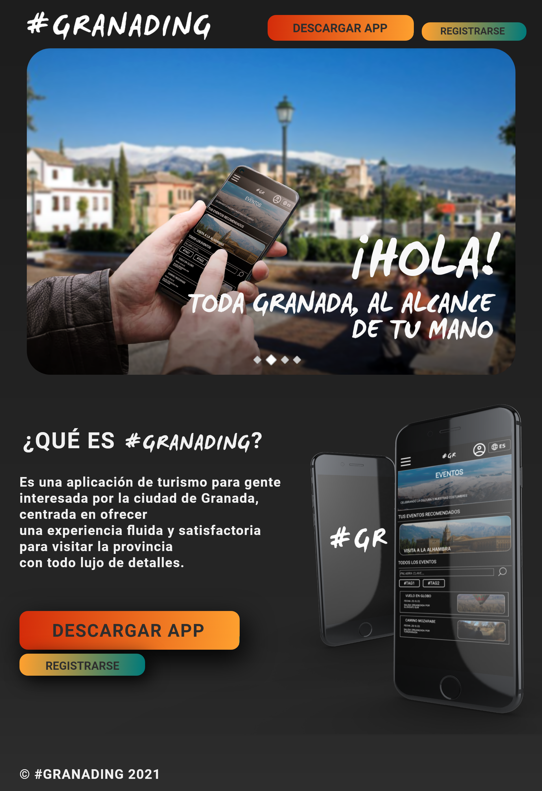

## Guidelines
> Características   
* Diseño minimalista : Evita una visión recargada del contenido, centrándose principalmente en los aspectos más relevantes en los que el usuario debe fijarse más, basándose en el uso de iconos sencillos y bordes redondeados para un aspecto más agradable visualmente.
* Tipografía y colores elegidos : Se ha elegido como fuente de uso principal Roboto Bold, y para elementos más destacables que den una apariencia más llamativa WC Mano Negra Bta. Prevalece el uso de las mayúsculas en los títulos para aportar una mayor visibilidad al conjunto.
En cuanto a la elección de colores, se ha optado por una tonalidad en la página mayormente monocromática o de escala de grises, junto con un par de colores que llamen la atención de determinados elementos en la página.

> Patrones  
* Navegación: usamos generalmente navegación de tipo menu lateral (Navigation drawer, Side navigation).

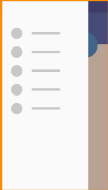

* Contenido: Botón, en alguna de las páginas usarémos Floating Action Button y en otras, botones normales fijos con icono

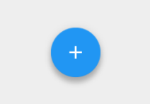
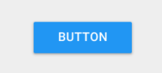

* Tecnica scroll: como los contenidos en algunos casos los contenidos tiene un tamaño indefinido, pues hacemos un scroll flexible. (Flexible space with overlapping content)

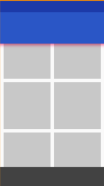

* Búsqueda: Se recurre a la utilización de un campo de texto en la página correspondiente, cuya búsqueda avanzada permite filtrar según unos tags (#) que facilitan la búsqueda por distintos temas. (Single-line text field, static content menu, raised buttons)

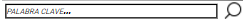

* Configuración: usamos configuración grupado en contenidos relacionados uno entre otros, y usaría separador para separar entre los grupos (Grouping settings + Divider lines), para activar y desactivar pues usaríamos un switch on/off (Switch settings)

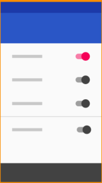

* Selección de opciones: en alguna de las pantallas (como idioma, opción de filtros...), permitimos seleccionar entre varios opciones, para ello, se usa un patrón Overflow menu.

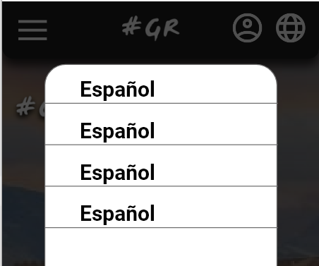

* Opciones con menu expandible: en algunos otros casos, pues ponemos menu expandible (Expanding navigation drawer), como por ejemplo en eventos/sitios guardado, en búsqueda, etc...

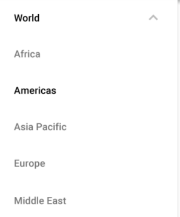

> Ejemplos y páginas de referencia.
* [Calisteniapp](https://calisteniapp.com/es): Hemos tomado como referencia el diseño simple de esta página, y la forma en la que destaca distintos elementos a partir de una paleta de colores sencilla en la que prevalece una escala de grises oscuros.
* [Spacex](https://spacex.com): El diseño minimalista basado en imágenes define el estilo de esta página, con el uso de tipografía muy resaltable y borde muy fino de los elementos.

## Mockup: LAYOUT HI-FI

> Apartir de el diseño Lo-Fi de práctica pasada, usando los elementos que hemos decidido en Moodboard y partiendo de los patrones que hemos decidido en Guidelines, hemos realizado siguiente diseño Hi-Fi usando el programa Adobe XD  : 
>> Hemos tomado las páginas más representativos de los estilos de diseño, los restos de pantallas que aparece en práctica 2 se rediseñaría de la misma manera usando este estilo 

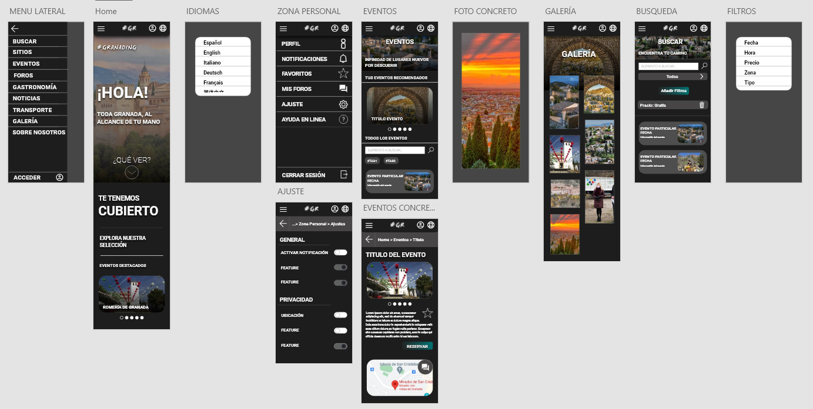

> Para ver con más claridad [pulse aquí](./DIU_P3_HIFI.pdf)

> Para ver video de su simulación [pulse aquí](https://drive.google.com/file/d/1HoynuFrj1FCan79ju-XzpHh0suU2qHZx/view?usp=sharing)

> Para simular con el fichero compartido de Adobe XD [pulse aquí](https://xd.adobe.com/view/af2ef7ee-9cd4-41c8-9eb6-d96b3ff3f03c-fa7d/)

## Documentación: Publicación del Case Study

> UX Case Study: [video](https://drive.google.com/file/d/1U9oaubc9Yr5WXv0Jf35ttR5V2KWTuD5q/view?usp=sharing)

> Valoración del equipo y problemas surgidos: 

Tras la realización de las 3 primeras secciones de esta práctica hemos valorado altamente las competencias necesarias tras el diseño de una interfaz funcional para el usuario, de forma que no sólo responda eficientemente a las acciones del usuario en la app, sino que además resulte atractiva visualmente y que se pueda navegar con facilidad a través de sus pantallas.  

Cabe destacar el análisis previo de una aplicación similar a la que queríamos hacer para fijarnos en qué enfocarnos más a la hora de su puesta en desarrollo: cuales eran sus puntos débiles, en qué aspecto fallaba más y por qué.
A partir de ello, deducimos un diseño inicial de nuestra aplicación atribuyéndole nuestro propio pensamiento crítico para crear una app que fuese la ideal para nuestro caso.
Tras el bocetado general se proyectó por simulación una posible realidad de la aplicación, la cual ha satisfecho prácticamente nuestra idea inicial de diseño.

Podemos decir que uno de los principales factores más complicados en el desarrollo de la práctica ha sido el hecho de reflejarse en la situación de otras personas para elaborar un diseño de personajes y un journey map lo más realista posible, de modo que pudiéramos equiparar sus situaciones con sucesos similares que se dieran en la realidad.

Mencionar por último la experiencia con la herramienta de diseño Adobe XD, la cual nos ha permitido plasmar con alto nivel de detalle nuestra idea sin necesidad de usar código para previsualizar lo que queríamos desarrollar. A pesar de haber elementos o acciones que nos ha costado replicar un poco de primeras con respecto a los patrones de diseño actuales, el manejo del programa ha resultado bastante intuitivo y fluido, lo que nos ha permitido trabajar con mucha mayor facilidad en la parte de simulación de la aplicación.

