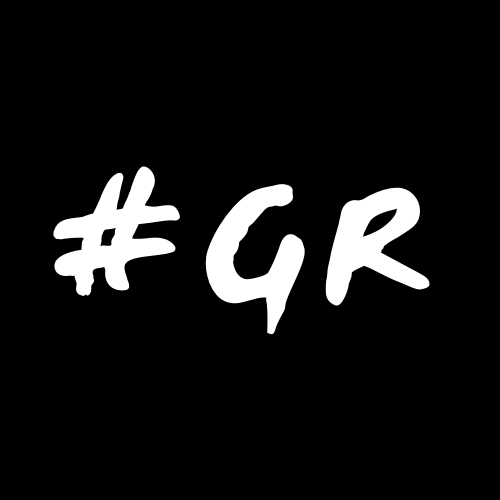

# DIU21
Prácticas Diseño Interfaces de Usuario 2020-21 (Tema: Turismo) 

Grupo: DIU2_mastodontes.  Curso: 2020/21 
Updated: 16/3/2021

Proyecto: 
> GRANADING

Descripción: 
> Aplicación de turismo para gente no residente en Granada que tiene muy poco conocimiento sobre la zona, centrada principalmente en ofrecer una experiencia fluida y satisfactoria para visitar la provincia 'con todo lujo de detalles'. Traducida a varios idiomas y que permita dar voz a gente que ya la haya visitado a través de la creación de distintos foros en los que otros usuarios podrán comentar, debatir y aconsejar según el tema propuesto. Para habitantes actuales en Granada podrían encontrar fácil y rápido la solución a "dónde ir" ya sea que quieran buscar un sitio cercano o popular.

Logotipo: 

Miembros:
 * :bust_in_silhouette:   José Antonio Sánchez Suárez     :octocat:	https://github.com/eProw
 * :bust_in_silhouette:  Weibin Wu     :octocat:	https://github.com/Wei-bin-Wu

----- 

# Proceso de Diseño 

## Paso 1. UX Desk Research & Analisis 

 1.a Competitive Analysis
-----
>Entre las plataformas que hemos visto la que más atractiva nos ha resultado de las cuatro que hemos analizado ([**Turgranada**](https://www.turgranada.es/), [**Moros y Cristianos de Benamaurel**](http://www.morosycristianosbenamaurel.com/), [**Jaén Paraíso Interior**](https://www.jaenparaisointerior.es/), [**Civitatis Granada**](https://www.granada.info/)) ha sido [**Turgranada**](https://www.turgranada.es/) particularmente por la calidad de diseño y su orientación al usuario final, y la variedad de idiomas que presenta.

Para un Analisis Competitivo más completo [consultar aquí](./P1/README.md).

---
 1.b Persona
-----

> Hemos seleccionado dos personajes: **Ava Bishop** (Perfil extranjero, necesita conocer su entorno para orientarse en la ciudad), y **Paul Romero** (Interesado en realizar actividades de turismo activo para cuidar su cuerpo).

Para consultar las gráficas de los personajes [pulsa aquí](./P1/README.md).

---

 1.c User Journey Map
----

>Ambas experiencias son representativas para los perfiles de las personas que hemos creado, sea por sus condiciones de movilidad o desinformación. Y concretamente la falta de información es un factor determinante que está presente en la experiencia de los usuarios que deciden planificar una salida en algún sitio de interés.

Para ver los JouneyMaps [consultar aquí](./P1/README.md).

 1.d Usability Review
----
> Enlace al documento: [Usability-review](./P1/Usability-review-ValoraciónUsabilidad.pdf).

> Valoración final: 79/100

Comentario sobre la valoración:

> Es una página que muestra bastante completitud en  primera instancia, muestra un diseño claro e intuitivo para el usuario, pero se echan en falta ciertos aspectos a nivel de funcionalidad como por ejemplo la busqueda de información a medida del usuario.

---
## Paso 2. UX Design  

 2.a Feedback Capture Grid / EMpathy map / POV
----

> En nuestro caso, hemos usado los tres diagramas para análisis de este apartado.

Para verlas [pulse aquí](./P2/README.md).
    
> En base a las tareas realizadas en la práctica anterior, hemos comprobado cuales pueden ser los intereses reales del usuario a partir de la creación de dos personas con gustos e ideales distintos y con sus respectivos journey maps. A raíz de estos, hemos detectado dónde falla la experiencia del usuario en la aplicación que hemos seleccionado para analizar y, fijándonos en los errores que posee a nivel de interacción y navegación, hemos pensado en una nueva aplicación que trate de subsanar dichas imperfecciones para garantizar una experiencia de ususario óptima.

 2.b ScopeCanvas
----
> Hemos llegado a esta solución del canvas a partir de los intereses y acciones esperadas del usuario en la aplicación (qué es lo que necesita, qué debe de realizar dentro de esta) y los intereses (a corto y largo plazo) y recursos de la organización para medir el éxito de la aplicación. 

Para ver nuestro Propuesta de valor [pulse aquí](./P2/README.md).

 2.b Tasks analysis 
-----

> Nos permite saber qué tipos de usuarios utilizan la aplicación, y en base a esto saber qué actividades tienen mayor importancia dentro de esta.

Para consultar nuestro User/task matrix y User/Task flow [pulse aquí](./P2/README.md).

 2.c IA: Sitemap + Labelling 
----

> Con esto obtenemos una idea más concreta para definir la aplicación, construyendo así de forma simplificada una jerarquía de páginas a partir de las cuales se podrá navegar.

Para consultar nuestro Sitemap y Labelling [pulse aquí](./P2/README.md).

 2.d Wireframes
-----

> A partir del Sitemap mostrado anteriormente, tendremos la posibilidad de ilustrar con mayor precisión el diseño de nuestra aplicación, ubicando los elementos necesarios en cada página y asignándoles un comportamiento determinado (Wireframe). A los elementos utilizadsos se les asignará un icono que representará su funcionalidad, la cual será descrita en el Labelling.

Para ver Wireframes [pulse aquí](./P2/README.md).

## Paso 3. Mi UX-Case Study (diseño)

 3.a Moodboard
-----

> El logotipo está orientado para que aparezca como icono de app o en distintas redes sociales, debido a su simplicidad y claridad para visualizarse.  
El herramienta utilizada para la creación del logotipo es la página web de [Canva](https://www.canva.com/), la resolución que vamos a emplear es de 500px x 500px.  
El estilo de este se quiere relacionar con un estilo 'hecho a mano' y artesanal con ciertas distinciones, como el que se identifica con el folclore andaluz, mezclado con
un aire moderno y digital, ayudándose mutuamente para ofrecer la mejor experiencia para el turismo. Ello justifica el uso del hashtag ('#') que tiene una verdadera relevancia en el uso de la app para la clasificación de distintos elementos, con la abreviatura del nombre de Granada (GR), y una tipografía que se asocie con la cultura y la historia de la ciudad.

Para ver nuestro Moodboard (incluido Logotipo) [pulse aquí](./P3/README.md).

  3.b Landing Page
----

> Usando editor de imagen + adobe XD hemos creado las imágenes y apariencia de un Landing Page.

Para verlo [pulse aquí](./P3/README.md).

 3.c Guidelines
----

> En nuestro caso, hemos elegido un diseño minimalista y algunos patrones.

Para más información [pulse aquí](./P3/README.md).

  3.d Mockup
----

>  Apartir de el diseño Lo-Fi, usando los elementos que hemos decidido en Moodboard y partiendo de los patrones que hemos decidido en Guidelines, hemos realizado diseño Hi-Fi usando el programa Adobe XD.

Para ver el diseño y la simulación [pulse aquí](./P3/README.md).

 3.e ¿My UX-Case Study?
-----

> Resumen del UX-Case Study en un video corto. Todos los documentos publicado en [Github](https://github.com/eProw/DIU21), y video compartido con GoogleDrive.  
También realizado una valoración de equipo y detectando algunos problemas surgidos.

Para ver nuestro video de UX-Case Study y la valoración [pulse aquí](./P3/README.md).

## Paso 4. Evaluación 

 4.a Caso asignado
----

> A: [Acogavi](https://github.com/daviyisu/DIU21)
Aplicación para organizar viajes y para hospedar gente que cuenta con un sistema de puntos con el que abaratar gastos.

> B: [SevillaFácil](https://github.com/laurasanpa/DIU21)
Aplicación de turismo para la ciudad de Sevilla que ofrece información sobre los sitios más emblemáticos de la ciudad, ofrece una guía gastronómica y una agenda con eventos culturales. 
Permite a los usuarios comentar mediante posts públicos y participar en las actividades culturales y de ocio propuestas.

 4.b User Testing
----

> Debido a las dificultades para encontrar gente hemos encontrado a 3 posibles usuarios (por ellos hemos pedido en realizar más de un test SUS para proyectos distintos). Estos evaluarán los dos proyectos asignados para la práctica más el nuestro, presentándose de la siguiente forma:
 
* **Usuario 1:** Un estudiante de ingeniería de telecomunicaciones, le gusta el senderismo por la naturaleza y ver series y películas, con mucha experiencia en el uso de dispositivos Android y ordenadores.
 
* **Usuario 2:**  Un estudiante de doble grado de matemáticas, apasionado de la natación, le gusta salir con amigos y tiene buena experiencia en el uso del móvil y el ordenador de escritorio.

* **Usuario 3:** Una estudiante de ciclo formativo, aficionada en baile urbano, interesada por aspectos como el healthcare, y le gusta investigar temas de mecánica y robótica, posee bastante experiencia con las plataformas móviles y con portátiles.
 

> Tener en cuenta que en la siguiente tabla de los resúmenes de los resultados, **test X** refiere a nuestro proyecto, **test A** refiere a primer equipo compañero y **test B** el segundo.

 | Usuarios | Sexo/Edad     | Ocupación   |  Exp.TIC    | Personalidad | Plataforma | TestA/B | Score
| ------------- | -------- | ----------- | ----------- | -----------  | ---------- | ---- | ----
| 1 | H / 23  | Estudiante  | Alta       | Positivo | Android/Ordenadores    | X,A,B | 82.5, 77.5, 55
| 2  | H / 19   | Estudiante  | Media       | Activo       | Móvil/PC        | A | 87.5
| 3  | M / 21   | Estudiante  | Media       | Ambiciosa       | Móvil        | X, B | 95, 100

>Metodología
Para elaborar el test se ha requerido de que las personas dispuestas a evaluar las aplicaciones realicen una serie de tareas. Dado que una de las apps era de un tipo distinto se han diseñado
tareas concretas para dicho caso.

Para el caso A:
-Crear una ruta real en la aplicación, pensando en las posibles opciones deseadas para su desarrollo dentro de la app.
-Crear un hospedaje con toda la información que se considere necesaria.

Para el caso B y X:
-Buscar un sitio concreto que visitar y obtener información acerca de este.
-Obtener recomendaciones sobre sitios a los que acudir y obtener información adicional sobre la ciudad.
-Encontrar todas las acciones que se ofrecen para el usuario dentro de la app.

Cabe destacar que, para la realización de dichas tareas, puesto que no se proporcionaba una aplicación real para cada caso, se ha supuesto la prueba visualizando las distintas 
capturas hi-fi de la P3 de cada proyecto, y haciendo que el usuario imaginase su experiencia en la aplicación a partir de dichas imágenes, de forma que se obtuviese una opinión lo más abstracta posible.

Para consultar más información y ver informe, conclusión y experiencia de los usuarios [pulse aquí](./P4/README.md). 

. 4.c Cuestionario SUS
----

> Usamos el **Cuestionario SUS** para valorar la satisfacción de cada usuario con el diseño (A/B) realizado.

En nuestro caso, obtenemos siguientes resultados:

> Como hemos dicho anteriormente, tenemos para cada proyecto dos test con usuarios 1, 2 y 3, lo mismo refiriendo a test X,A,B

 4.d Usability Report
----

> Report de usabilidad y valoración

Para ver el report y valoración [pulse aquí](./P4/README.md) (todos dentro del informe).

----

## Paso 5. Evaluación de Accesibilidad  (No llegado a hacer)

  5.a Accesibility evaluation Report 
----

>>> Indica qué pretendes evaluar (de accesibilidad) sobre qué APP y qué resultados has obtenido 

>>> 5.a) Evaluación de la Accesibilidad (con simuladores o verificación de WACG) 
>>> 5.b) Uso de simuladores de accesibilidad 

>>> (uso de tabla de datos, indicar herramientas usadas) 

>>> 5.c Breve resumen del estudio de accesibilidad (de práctica 1) y puntos fuertes y de mejora de los criterios de accesibilidad de tu diseño propuesto en Práctica 4.

## Conclusión final / Valoración de las prácticas

>>> (90-150 palabras) Opinión del proceso de desarrollo de diseño siguiendo metodología UX y valoración (positiva /negativa) de los resultados obtenidos  

